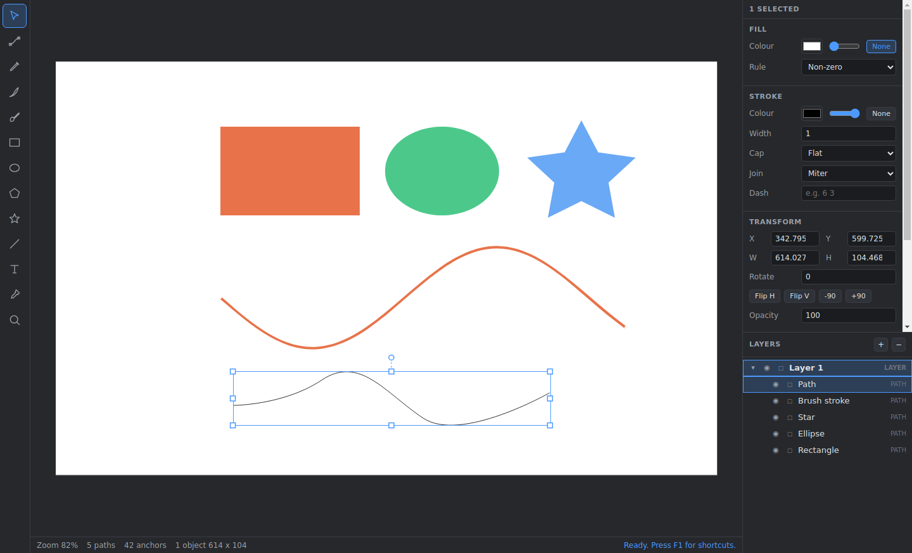

# Vectar Editor

*[English README](README.md)*

Windows 向けのベクター画像編集ソフトです。画像を読み込んで編集可能なベクターデータとして
再現し、その上からブラシ・図形・文字で自由に描き足して、各種のベクター形式・画像形式へ
書き出せます。

Electron と TypeScript で作られています。幾何計算・文書モデル・ベクター化・ファイル形式は
実行時依存のない素の TypeScript なので、Node で直接単体テストできます。



## できること

**読み込みとベクター化。** PNG・JPEG・WebP・BMP・GIF を開くと、トレーサが本物のベクター図形に
変換します。中央値分割を k-means で精緻化して色数を減らし、各色の領域を画素の境界（クラック）
追跡で抽出し、得られた輪郭を簡略化してベジェ曲線で近似します。穴（ドーナツ形状）も正しく
再現され、しきい値より小さいノイズは除去されます。プリセットは写真・フラットアート・線画・
ドット絵の正確なトレースを用意しています。1920×1440 の写真でおよそ 2.5 秒です。

SVG ファイルを開くこともできます。この場合はトレースせず編集可能なオブジェクトとして
読み込みます。ベクター化せずビットマップをそのまま配置することも可能です。

**ベクターとして編集。**

- キャンバス上のハンドルで選択・移動・拡大縮小・回転。矩形選択、矢印キーによる微調整。
- パスを直接編集。アンカーとベジェハンドルのドラッグ、輪郭をクリックしてアンカーを追加、
  アンカーの削除、コーナー／スムーズ／対称の切り替え。
- ペン（クリックで角、ドラッグで曲線）、鉛筆、筆圧対応ブラシで描画。ブラシの描線もベジェ曲線に
  変換されるので、あとから編集できます。
- 矩形・楕円・多角形・星・線を配置。角丸半径、辺の数、頂点数を指定できます。
- その場編集でテキストを追加。フォント、サイズ、太さ、字間、行間、揃えを指定できます。
- レイヤーとグループで整理。ドラッグ&ドロップで並べ替え、ロックと非表示、すべて取り消し可能。

**書き出し。** ベクターのまま出力する SVG と PDF、および 0.5〜4 倍でラスタライズする
PNG・JPEG・WebP・BMP（透過の有無を選択可）。

## 動作要件

- Node.js 22 以降（ビルドとテストがネイティブの TypeScript サポートを使います）
- パッケージ版の実行には Windows 10 または 11

## ソースから実行する

```
npm install
npm start
```

`npm start` はバンドルをビルドして Electron を起動します。開発中は、片方の端末で
`npm run watch` を走らせて変更を監視しつつ、もう片方で `npm run dev` を実行すると便利です。

## 検査

```
npm run check      # 型検査 → テスト一式
npm run typecheck
npm test
```

テストは、幾何・パスの計算、SVG パスの解析と生成、文書モデルと取り消し履歴、
ベクター化の通し動作、SVG・PDF・ネイティブ形式の入出力を対象にしています。

## Windows インストーラのビルド

```
npm run dist:win
```

`release/` に次のものが生成されます。

- `Vectar Editor-<version>-x64.exe` — NSIS インストーラ。インストール先を選択でき、
  `.vectar` の関連付けを登録します
- `Vectar Editor-<version>-portable.exe` — 単一ファイルの可搬版

`npm run dist:win:portable` は可搬版だけをビルドします。

**Linux や macOS からのクロスビルドには Wine が必要です。** electron-builder が実行ファイルへ
アイコンとバージョン情報を埋め込むのに使います。Wine がない場合、アプリのパッケージング自体は
正常に完了し、その段階で停止します。Windows 上でのビルドには追加のものは要りません。

## ディレクトリ構成

各モジュールの詳細、レイヤ構造の規則、主要なデータの流れについては
[実装仕様書](docs/IMPLEMENTATION.md)を参照してください。

```
src/core/           プラットフォーム非依存。実行時依存なし
  geometry/         ベクトル、アフィン行列、矩形、3次ベジェ
  path/             アンカー/ハンドルのパスモデル、SVG `d` の解析、図形生成
  model/            色、スタイル、シーンノード、レイヤー、問い合わせ、取り消し履歴
  trace/            色量子化、輪郭追跡、簡略化、曲線フィッティング
  brush/            フリーハンドの描線から輪郭パスへの変換
  render/           シーン描画。Canvas2D に構造的に型付け
  io/               SVG、PDF、ネイティブ形式 `.vectar`
src/main/           Electron メインプロセス：ウィンドウ、メニュー、ダイアログ、IPC
src/renderer/       エディタ UI
  tools/            ツール 1 つにつき 1 モジュール
  panels/           ツールバー、レイヤー、プロパティ、ステータスバー
test/               単体テスト。`node --test` が実行
```

`core` は `main` も `renderer` も import しません。これにより Electron なしでテストでき、
IPC 境界の両側で同じコードを再利用できます。

## ファイル形式

| 形式 | 読み込み | 書き出し | 備考 |
| --- | --- | --- | --- |
| `.vectar` | ○ | ○ | ネイティブ形式。文書モデルを JSON で保存 |
| SVG | ○ | ○ | 図形、パス、グループ、変換、グラデーション、テキスト |
| PNG / JPEG / WebP / BMP / GIF | ○ | ○（GIF を除く） | トレースまたは配置で読み込み。ラスタライズして書き出し |
| PDF | × | ○ | ベクターのまま 1 ページで出力 |

## キーボード操作

| キー | 動作 |
| --- | --- |
| `V` / `A` | 選択 / ノード編集 |
| `P` / `N` / `B` | ペン / 鉛筆 / ブラシ |
| `R` / `E` / `L` / `T` | 矩形 / 楕円 / 線 / テキスト |
| `I` / `Z` | スポイト / ズーム |
| Space + ドラッグ、または中ボタンドラッグ | 画面の移動 |
| ホイール | スクロール。`Ctrl` / `Alt` + ホイールでズーム |
| `Ctrl+0` / `Ctrl+1` | ウィンドウに合わせる / 等倍表示 |
| `Ctrl+Z` / `Ctrl+Y` | 取り消し / やり直し |
| `Ctrl+G` / `Ctrl+Shift+G` | グループ化 / グループ解除 |
| `Ctrl+Shift+I` | 画像を読み込んでベクター化 |
| `Ctrl+E` | 書き出し |
| ドラッグ中に `Shift` | 軸・角度・縦横比を固定 |
| ドラッグ中に `Alt` | 図形を中心から描く |

アプリ内で `F1` を押すと一覧が表示されます。

## 現時点の制限

隠れた不具合ではなく既知の機能的な制限です。想定外とならないよう明記しておきます。

- **テキストのアウトライン化は未実装です。** 書き出した SVG は `<text>` 要素のまま保持し、
  PDF 書き出しは実際のフォントを埋め込まず標準の基本フォント（Helvetica、Times、Courier）へ
  対応付けます。そのため **WinAnsi の範囲外の文字、日本語を含むテキストは、書き出した PDF では
  表示されません。** SVG や PNG への書き出しであれば問題ありません。
- **パスのブーリアン演算（合成・型抜き・交差）は未実装です。**
- **グラデーションは読み込み・書き出し・描画に対応していますが、作成・編集の UI はまだありません。**
  プロパティパネルで編集できるのは単色です。
- **SVG 読み込みでは** `<use>` 参照、クリップパス、マスク、フィルタ、パターン塗りを
  読み飛ばします。何を飛ばしたかは読み込み時に報告します。また、継承元となる CSS の
  カスケードが存在しないため `currentColor` は黒に解決されます。
- **PDF 書き出しは最小限の実装です。** 相互参照テーブルのオフセットが各オブジェクトを
  正しく指していることを含め、構造はテストで検証していますが、あらゆる PDF ビューアでの
  表示確認までは行っていません。
- トレーサは塗りつぶされた色領域を対象とします。線画を 1 本のストロークに変換する
  中心線トレースのモードはありません。

## ライセンス

CC0 1.0 Universal。`LICENSE` を参照してください。
