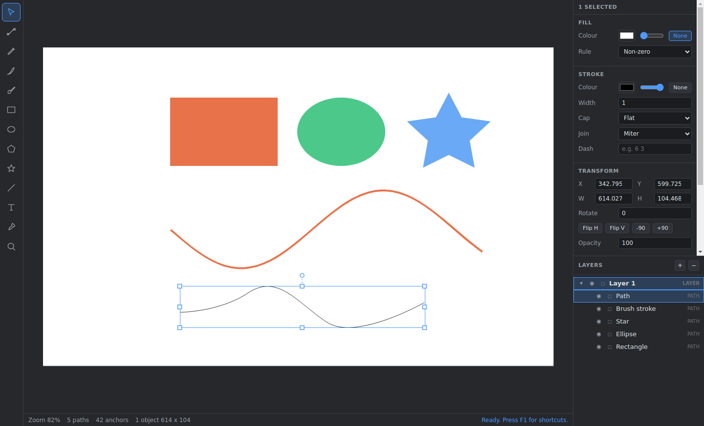

# Vectar Editor

A vector graphics editor for Windows. It imports an image, reproduces it as
editable vector data, lets you draw freely on top with a brush, shapes and
text, and exports to a range of vector and raster formats.

Built with Electron and TypeScript. The geometry, document model, vectorizer
and file formats are plain TypeScript with no runtime dependencies, so they
are unit tested directly under Node.



## What it does

**Import and vectorize.** Open a PNG, JPEG, WebP, BMP or GIF and the tracer
turns it into real vector shapes: the palette is reduced by median cut refined
with k-means, each colour's regions are extracted by following the cracks
between pixels, and those outlines are simplified and fitted with bezier
curves. Holes come out right, speckle below a size threshold is dropped, and
presets cover photos, flat art, line art and exact pixel-art tracing. A
1920x1440 photo traces in roughly 2.5 seconds.

You can also open SVG files, which are read as editable objects rather than
traced, or place a bitmap as-is without vectorizing it.

**Edit as vectors.**

- Select, move, scale and rotate with on-canvas handles; marquee select; nudge
  with the arrow keys.
- Edit paths directly: drag anchors and their bezier handles, add anchors by
  clicking the outline, delete anchors, and cycle an anchor between corner,
  smooth and symmetric.
- Draw with the pen (click for corners, drag for curves), the pencil, or a
  pressure-sensitive brush whose stroke is fitted back to bezier curves so it
  stays editable.
- Place rectangles, ellipses, polygons, stars and lines, with corner radius,
  side and point counts.
- Add text with an in-place editor, with font, size, weight, spacing,
  line height and alignment.
- Organise with layers and groups, reorder by drag-and-drop, lock and hide,
  and undo anything.

**Export.** SVG and PDF as true vector output, plus PNG, JPEG, WebP and BMP
rasterized at 0.5x to 4x, with optional transparency.

## Requirements

- Node.js 22 or newer (the build and tests use its native TypeScript support)
- Windows 10 or 11 to run the packaged application

## Running from source

```
npm install
npm start
```

`npm start` builds the bundles and launches Electron. For iterative work,
`npm run watch` rebuilds on change in one terminal while `npm run dev` runs
the app in another.

## Checks

```
npm run check      # typecheck, then the full test suite
npm run typecheck
npm test
```

The tests cover the geometry and path maths, the SVG path parser and
serializer, the document model and undo stack, the vectorizer end to end, and
the SVG, PDF and native file formats.

## Building a Windows installer

```
npm run dist:win
```

This produces, in `release/`:

- `Vectar Editor-<version>-x64.exe` — an NSIS installer that lets the user
  choose the install directory and registers the `.vectar` file association
- `Vectar Editor-<version>-portable.exe` — a single-file portable build

`npm run dist:win:portable` builds only the portable executable.

**Cross-building from Linux or macOS needs Wine**, which electron-builder uses
to stamp the icon and version resources into the executable. Without it the
build packages the application correctly and then stops at that step. Building
on Windows needs nothing extra.

## Project layout

```
src/core/           platform-agnostic, no runtime dependencies
  geometry/         vectors, affine matrices, rectangles, cubic beziers
  path/             anchor/handle path model, SVG `d` parsing, shape builders
  model/            colours, styles, scene nodes, layers, queries, undo stack
  trace/            quantization, contour tracing, simplification, curve fitting
  brush/            freehand stroke to outline conversion
  render/           scene renderer, typed structurally against Canvas2D
  io/               SVG, PDF and the native `.vectar` format
src/main/           Electron main process: window, menu, dialogs, IPC
src/renderer/       the editor UI
  tools/            one module per tool
  panels/           toolbar, layers, properties, status bar
test/               unit tests, run by `node --test`
```

The core never imports from `main` or `renderer`, which is what lets it be
tested without Electron and reused on both sides of the IPC boundary.

## File formats

| Format | Import | Export | Notes |
| --- | --- | --- | --- |
| `.vectar` | yes | yes | Native format; the document model as JSON |
| SVG | yes | yes | Shapes, paths, groups, transforms, gradients, text |
| PNG / JPEG / WebP / BMP / GIF | yes | yes (not GIF) | Imported by tracing or placing; exported by rasterizing |
| PDF | no | yes | True vector output, one page |

## Keyboard

| Keys | Action |
| --- | --- |
| `V` / `A` | Select / Edit nodes |
| `P` / `N` / `B` | Pen / Pencil / Brush |
| `R` / `E` / `L` / `T` | Rectangle / Ellipse / Line / Text |
| `I` / `Z` | Eyedropper / Zoom |
| Space + drag, or middle drag | Pan |
| Wheel | Scroll; `Ctrl`/`Alt` + wheel to zoom |
| `Ctrl+0` / `Ctrl+1` | Fit to window / Actual size |
| `Ctrl+Z` / `Ctrl+Y` | Undo / Redo |
| `Ctrl+G` / `Ctrl+Shift+G` | Group / Ungroup |
| `Ctrl+Shift+I` | Import an image and vectorize it |
| `Ctrl+E` | Export |
| `Shift` while dragging | Constrain to axis, angle or aspect |
| `Alt` while dragging | Draw shapes from the centre |

Press `F1` in the application for the full list.

## Current limitations

These are real gaps rather than hidden bugs, listed so they are not a surprise:

- **Text is not converted to outlines.** Exported SVG keeps `<text>` elements,
  and PDF export maps the font onto one of the standard PDF base fonts
  (Helvetica, Times or Courier) rather than embedding the real one. Text
  outside WinAnsi, including Japanese, will not render in exported PDFs.
- **No boolean path operations** (union, subtract, intersect).
- **Gradients can be imported, exported and rendered, but there is no UI for
  creating or editing them yet** — the properties panel edits solid colours.
- **SVG import skips** `<use>` references, clip paths, masks, filters and
  pattern fills. The importer reports which of these it skipped. There is no
  CSS cascade to inherit from, so `currentColor` resolves to black.
- **PDF export is a minimal writer.** Its structure is verified by tests,
  including that the cross-reference offsets point at their objects, but it has
  not been checked against the full range of PDF readers.
- The tracer works on filled colour regions. There is no centreline tracing
  mode for turning line art into single strokes.

## Licence

CC0 1.0 Universal. See `LICENSE`.
